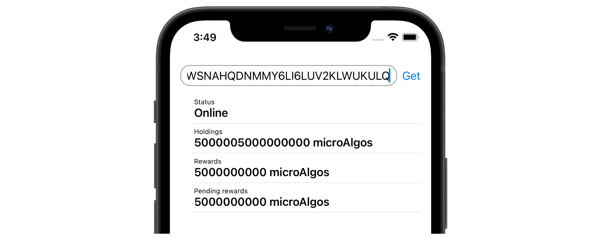

# Algonaut iOS example




Shows how to use [Algonaut](https://github.com/manuelmauro/algonaut) in a native iOS app.

⚠️ Not tested in production yet \*

### Architecture

- Rust core (shareable with other platforms, e.g. [web](https://github.com/i-schuetz/algorand-yew-example)), with domain logic and services, like accessing Algonaut.
- Native app (SwiftUI, etc.)

### Instructions

Install [rustup](https://rustup.rs/)

- Add targets

```
rustup target add x86_64-apple-ios aarch64-apple-ios
```

- Run the project in Xcode. This will build Rust and start the app.

### Contributing

1. Fork
2. Commit changes to a branch in your fork
3. Push your code and make a pull request

\* _It has been tested on real devices but not uploaded to the App Store or distributed. It should™ work, but just in case. If you use an app based on this example in production, please let me know: [ivanhp978@gmail.com](mailto:ivanhp978@gmail.com) or [issues](https://github.com/i-schuetz/algonaut_ios/issues)_
